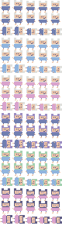
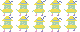
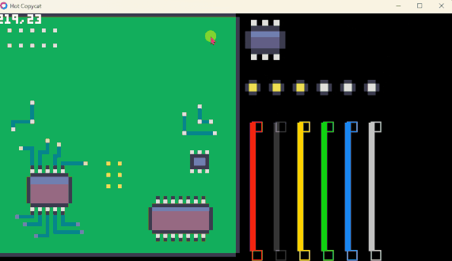

# HOT COPY CAT
FRENJAM @ 2025 - THEME " BOOTLEGS "  
[https://itch.io/jam/love2d-jam-2025  ](https://itch.io/jam/frenjam)

### GAME PLAN: You run a hot copy cat business modding consoles so they can play backup games ;) not illegal copies... 

Progress bar:   
1st session (3h:15m):  
idea dev, spriting  
  
  
   
  
  
 
  
2nd session (3h:27m)  
  

3rd session (1h:24m)  
  
  
4th session (2h:38m)  
  
  
5th session (4h:26m)  
  

Coding setup: VScode
Spriting: Asesprite

Atributions:  
https://github.com/adekto/maid64

https://github.com/kikito/anim8  

https://github.com/kikito/tween.lua  

Icon pack:  
https://kenney.nl/assets/cursor-pixel-pack  
https://kenney.nl/assets/input-prompts-pixel-16  

Sfx:  
Soldering iron:  
EMF recording - Soldering Iron by alexdarek -- https://freesound.org/s/701636/ -- License: Attribution 4.0  

Glue:  
SFX_STICKERRIPPER_slayer_92.wav by MrFossy -- https://freesound.org/s/590525/ -- License: Creative Commons 0  

Pickup:  
b2.ogg by Pellepyb -- https://freesound.org/s/431670/ -- License: Creative Commons 0  

Music:    
https://www.looperman.com/loops/detail/394283/drama-party-free-175bpm-trap-drum-loop  

